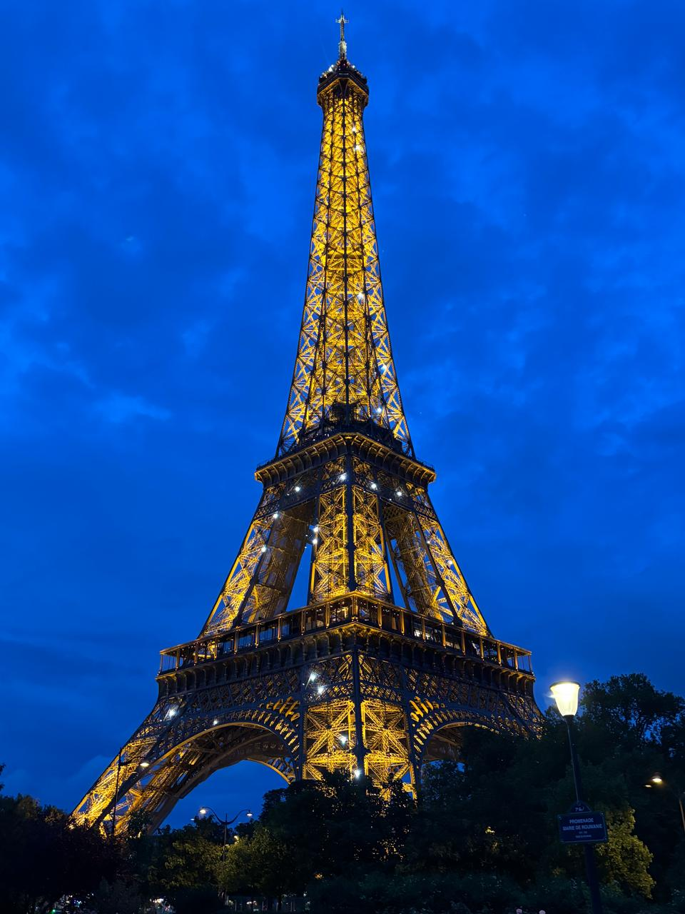
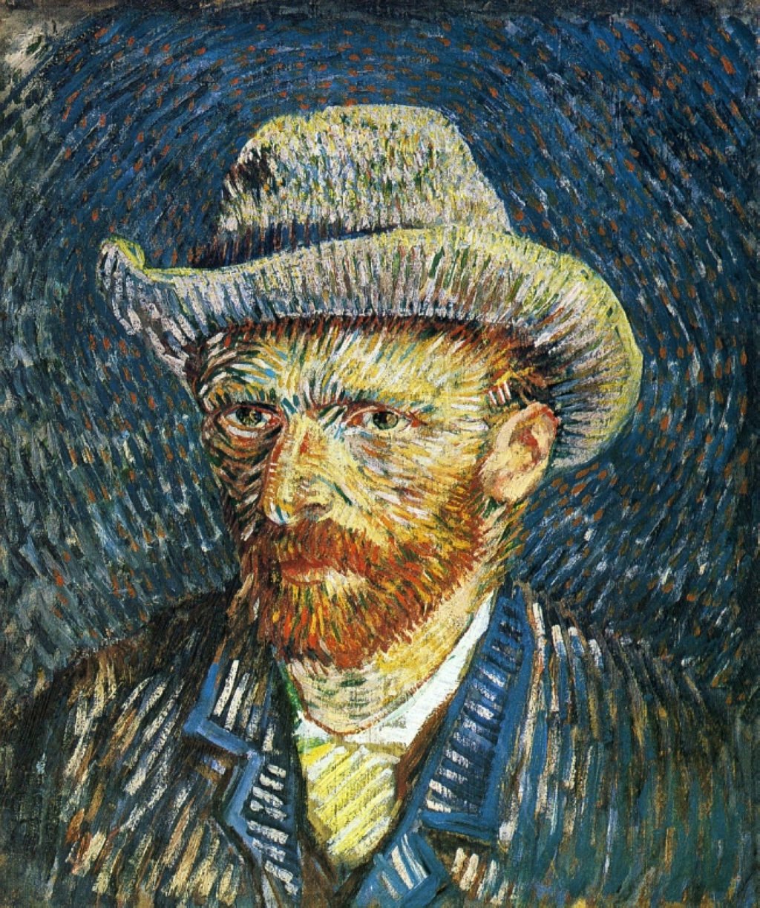
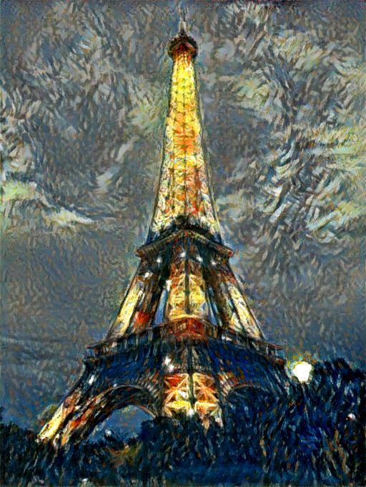
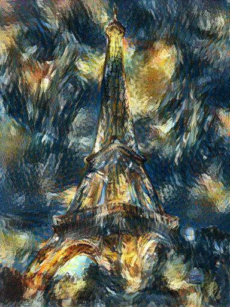

# Neural Style Transfer — Gatys et al. (CVPR 2016)

**Paper:** Image Style Transfer Using Convolutional Neural Networks  
**Course:** GNR 638

## About
Implementation of the Gatys et al. neural style transfer algorithm using VGG-19.
Includes comparison between the original author's implementation and our own.

## Results

| Content | Style | Author Implementation | Our Implementation |
|---|---|---|---|
|  |  |  |  |

## Key Differences
- **Author:** Uses original Caffe VGG weights, BGR preprocessing, max pooling
- **Ours:** Uses PyTorch ImageNet VGG19, RGB preprocessing, average pooling (paper recommendation)

## References
```
Gatys, L.A., Ecker, A.S., Bethge, M. (2016).
Image Style Transfer Using Convolutional Neural Networks. CVPR 2016.
```
